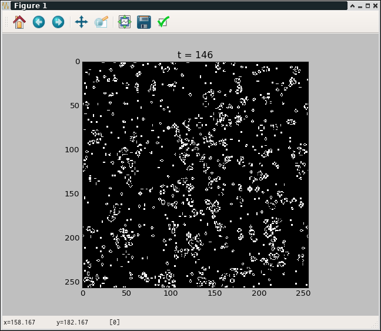

I would like to make cell-automaton with simple code. 

# [Game of Life](https://www.wikiwand.com/en/Conway%27s_Game_of_Life)

It can be simply implemented using scipy convolution calculation utility because the 2D cell-automaton can be treat as a patch-wise binary image processing. Similarly, matplotlib is available to display it. (Note that due to visualizing it as a image, scaling may drop cells in the image.)



```python
import numpy as np
import scipy.signal
import matplotlib.pyplot as plt

h = np.array([[1, 1, 1],
              [1, 0, 1],
              [1, 1, 1]])
def update(U):
    '''
    Update rule:
    current_state＼N_neighbors | 0   1   2   3   4   5   6   7   8
    ---------------------------+----------------------------------
                             0 | 0   0   0   1   0   0   0   0   0
                             1 | 0   0   1   1   0   0   0   0   0
    '''
    N_neighbors = scipy.signal.convolve2d(U, h, boundary='wrap', mode='same')
    U_next = np.zeros_like(U)
    U_next[N_neighbors == 3] = 1
    U_next[np.logical_and(N_neighbors == 2, U == 1)] = 1
    return U_next

size = (256, 256)
U = np.random.randint(2,size=size)

fig = plt.figure()
ax = fig.add_subplot(111)
img = ax.imshow(U, interpolation="nearest", cmap=plt.cm.gray)

i = 0
while True:
    U = update(U)
    img.set_data(U)
    i += 1
    ax.set_title("t = {}".format(i))
    plt.pause(0.01)

```


# [Turing Pattern](https://www.wikiwand.com/en/Turing_pattern)


The same implementation can be applied to reaction-diffusion system. Try to use Turing pattern's updating formula in this article.


$$
\begin{align}
\frac{\partial u}{\partial t} &= D_u \nabla u + u ( 1 - u^2) - v \\
\frac{\partial v}{\partial t} &= D_v \nabla v + 3 u - 2 v 
\end{align}
$$

$$u(x,y)$$ is used as a pixel value at $$(x, y)$$, though $$v(x, y)$$ is only used for the calculation. $$D_u$$, $$D_v$$ are diffusion coefficients. The coefficients affect whether the 'pattern' is formed or not. In this article, I use $$D_u = 0.2$$, $$D_v = 1.8$$ to form the pattern. The values are selected with try and error. And laplacian filter, which is a convolution filtering, is useful to calculate $$\nabla$$.


```python
import numpy as np
import scipy.ndimage.filters
import matplotlib.pyplot as plt

lap = lambda X: scipy.ndimage.filters.laplace(X)
def update(U, V, Du=0.2, Dv=1.8):
    return (Du*lap(U) + U*(1.-U*U) - V,
            Dv*lap(V) + 3.*U - 2.*V)

size = (64, 64)
U = np.random.random(size)
V = np.random.random(size)
dt = 0.1

fig = plt.figure()
ax = fig.add_subplot(111)
img = ax.imshow(U, interpolation="nearest", cmap=plt.cm.gray)

view_interval = 10
for i in range(10000):
    dU, dV = update(U, V)
    U += dt*dU
    V += dt*dV
    if i % view_interval == 0:
        img.set_data(U)
        ax.set_title("t = {}".format(i))
        plt.pause(0.01)
plt.show()
```

Another updating formula like [FitzHugh-Nagumo model](https://www.wikiwand.com/en/FitzHugh%E2%80%93Nagumo_model) can be applied the same way.
